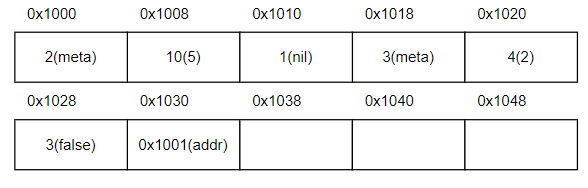

## concrete syntax

new features beyond Diamondback is marked as (!new)
```
<prog> := <defn>* <expr>               
<defn> := (fun (<name> <name>*) <expr>)
<expr> :=
  | <number>
  | true
  | false
  | input
  | nil                               (!new)
  | <identifier>
  | (let (<binding>+) <expr>)
  | (<op1> <expr>)
  | (<op2> <expr> <expr>)
  | (set! <name> <expr>)
  | (if <expr> <expr> <expr>)
  | (block <expr>+)
  | (loop <expr>)
  | (break <expr>)
  | (<name> <expr>*)
  | (tuple <expr>+)                   (!new)
  | (index <expr> <expr>)             (!new)
  | (setindex! <expr> <expr> <expr>)  (!new)
<op1> := add1 | sub1 | isnum | isbool | print
<op2> := + | - | * | < | > | >= | <= | =

<binding> := (<identifier> <expr>)
```

### Semantics

Similar to the Diamondback, the Egg Eater program always valuates to a single integer, a single boolean, a tuple or ends with an error. When ends with a tuple, the program will print the contents of the tuple in `(t1, t2, ..., tn)` format.

- `tuple` accenpts one or more expressions and evaluates each of the expressions. The result can be nested tuples, `nil`, or any other values in previous assignments.
- `index` will check the tags of the first argument as address and second argument as integer. The result of this expression could be integer, boolean or address.
- `setindex!` take three arguments, and it check the first argument as address and second argument as integer. The third expression can be in any type. The return of this expression is the address evaluated from first expression.
- tag representation for each value:
  - boolean: true (0bxxx111), false (0nxxx011)
  - value: (0bxxxxx0), append 0 to the last bit
  - address: (0bxxx001), nil (0b000001). Each address will be the heap address of the first word of the tuple +1.

### heap allocated values

For each tuple, the first word will be the length of tuple, the rest of each word corresponds to the values of each element. Below is an example of heap when execute `(tuple 2 false (tuple 5 nil))`. Since this program will execute from inner to outer expression, `(tuple 5 nil)` evaluates first. The length of this tuple is 2, and two elements are allocated after this metadata 2. For outer tuple, the third element is the inner tuple, so the address of the tuple is stored in 0x1030. Note we have same 3 for length and false value. This is unambiguous since when access heap value, the first position must be the length of tuple.



## test cases

##### simple_example.snek
```
(block
    (let (
            (m (tuple 2 4 nil false))
            (n (tuple m 2 3))
        )
        (block
            (print m)
            (print n)
            (setindex! m (+ 1 1) n)
            (print m)
            (print n)
        )
    )
    (let (
            (m (tuple 2 4 nil (tuple false 2 (tuple nil) 5)))
        )
        (print (index (index (index m 3) 2) 0))
    )
    (let (
        (m (tuple (= true false) (= 2 8)))
        (n (tuple (= 3 8)))
     )
        (block
            (print (= m m))
            (= m n)
        )
    )
)
```
the output from `stdout` is:
> (2, 4, nil, false)\
((2, 4, nil, false), 2, 3)\
(2, 4, ((...), 2, 3), false)\
((2, 4, (...), false), 2, 3)\
nil\
true\
false

Note: when compare two address using `=`, the program compares their reference address. For recursive tuple, it will display (...).

##### error-tag.snek

```
(let (
        (a (tuple 2 3))
        (b 5)
     )
    (+ a b)
)
```

the output is:
> \> ./tests/error_tag.run\
invalid argument

`(+ a b)` will generate a runtime error since `+` only accepts number, and type check will fail when type mismatches.

##### error-bound.snek

```
(let (
        (a (tuple 2 3 5))
        (b (tuple 1 a 2))
     )
    (block
        (print b)
        (print (index b 1))
        (print (index (index b 1) 3))
    )
)
```

the output is:
> \> ./tests/error_bounds.run\
(1, (2, 3, 5), 2)\
(2, 3, 5)\
index out of bound

`(index (index b 1) 3)` will generate the error. Tuple a only has 3 elements, so visiting the 4th element of tuple is invalid.

##### error3.snek
```
(tuple)
```

the output is:

> \> make tests/error3.run
cargo run -- tests/error3.snek tests/error3.s
        Finished dev [unoptimized + debuginfo] target(s) in 0.02s
          Running `target/debug/diamondback tests/error3.snek tests/error3.s`
thread 'main' panicked at 'Invalid tuple', src/main.rs:222:25
note: run with `RUST_BACKTRACE=1` environment variable to display a backtrace
make: *** [Makefile:11: tests/error3.s] Error 101

In the concrete syntax, it specifies that tuple should contain at least 1 element. So this program cannot pass the parser.

##### points.snek
```
(fun (createPoint x y)
    (tuple x y)
)

(fun (addPoints a b)
    (tuple (+ (index a 0) (index b 0)) (+ (index a 1) (index b 1)))
)

(block
    (let (
            (a (createPoint 2 3))
            (b (createPoint 5 input))
        )
        (print (addPoints a b))
    )
    (let (
            (a (createPoint -2 3))
            (b (createPoint -5 10))
        )
        (print (addPoints a b))
    )
    (let (
            (a (createPoint -2 3))
            (b (createPoint -5 10))
        )
        (let (
                (c (addPoints a b))
            )
            (addPoints a c)
        )
    )
)
```

the output from `stdout` is:
> (7, 4)\
(-7, 13)\
(-9, 16)

Note: if input is not a number, the program will have a runtime error.

##### bst.snek
```
(fun (createNode val left right)
    (tuple val left right)
)

(fun (getVal node)
    (index node 0)
)

(fun (getLeft node)
    (index node 1)
)

(fun (getRight node)
    (index node 2)
)

(fun (insert val root)
    (if (= root nil)
        (createNode val nil nil)
        (if (< val (getVal root))
            (setindex! root 1 (insert val (getLeft root)))
            (setindex! root 2 (insert val (getRight root)))
        )
    )
)

(fun (check val root)
    (if (= root nil)
        false
        (let ((value (getVal root)))
            (if (= val value)
                true
                (if (< val value)
                    (check val (getLeft root))
                    (check val (getRight root))
                )
            )
        )
    )
)

(block
    (let (
        (bst (insert 9 (insert 2 (insert 6 (insert 7 (insert 5 (insert 3 nil)))))))
         )
        (block
            (print bst)
            (print (check 2 bst))
            (print (check 9 bst))
            (print (check 10 bst))
        )
    )
    (let (
        (bst (insert 10 (insert 11 (insert 9 (insert 7 (insert 5 (insert 3 nil)))))))
         )
        (block
            (print bst)
            (print (check 3 bst))
            (print (check 7 bst))
            (print (check 10 bst))
        )
    )
    (let (
        (bst (insert 6 (insert 8 (insert 7 (insert 2 (insert 4 (insert 3 (insert 5 nil))))))))
         )
        (block
            (print bst)
            (print (check 2 bst))
            (print (check 9 bst))
            (print (check 10 bst))
        )
    )
    (let (
        (bst nil)
         )
        (block
            (print bst)
            (print (check 2 bst))
            (print (check 9 bst))
            (print (check 10 bst))
        )
    )
    nil
)
```

the output from `stdout` is:

>(3, (2, nil, nil), (5, nil, (7, (6, nil, nil), (9, nil, nil))))
>true
>true
>false
>(3, nil, (5, nil, (7, nil, (9, nil, (11, (10, nil, nil), nil)))))
>true
>true
>true
>(5, (3, (2, nil, nil), (4, nil, nil)), (7, (6, nil, nil), (8, nil, nil)))
>true
>false
>false
>nil
>false
>false
>false
>nil

Note: here I use `setindex!` to modify the tree inplace.

## comparison with other languages

for language like C, it uses a malloc api to directly create some space in the heap, the head of this area is then returened. C will not handle the bound checking to improve the speed. 

For language like rust, while creating a vector, a struct is put on the stack. This struct contains a pointer to the heap allocated space, and two integers to store the metadata about the size of the vector. 

The design here is more similar to Rust, though I choose to put the metadata on the first element of the heap.

## reference

Array Representation by Compiler, https://dotnettutorials.net/lesson/array-representation-compiler/

Introduction to Binary Search Tree – Data Structure and Algorithm Tutorials, https://www.geeksforgeeks.org/introduction-to-binary-search-tree-data-structure-and-algorithm-tutorials/

Binary Search Tree(BST), https://www.programiz.com/dsa/binary-search-tree

x86-64 quick reference (Brown), https://cs.brown.edu/courses/cs033/docs/guides/x64_cheatsheet.pdf

Ed Stem Post: Egg-eater conflicting requirements? https://edstem.org/us/courses/38748/discussion/3125816